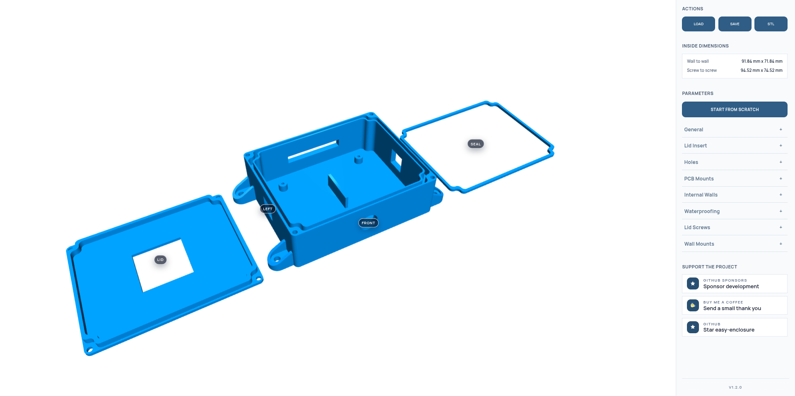

# Easy Enclosure

EasyEnclosure is an open-source 3D modeling software tailored specifically for designing 3D-printable enclosures. It aims to provide an intuitive interface and a set of user-friendly controls that allow even those with little or no 3D modeling experience to create custom enclosures for their electronic projects, prototypes, or DIY gadgets.

### **[Try it online now](https://bruceborrett.github.io/easy-enclosure/)**

## Key Features

* User-Friendly Interface
* Real-Time 3D Preview
* Export to STL Format

## Technology Stack

Typescript, React, JSCad

## Contributions

If you find this software useful and would like to see further development please consider [donating](https://www.buymeacoffee.com/bruceborrett) or [sponsoring]() :pray:

It is very time consuming and expensive to continuously test prints with all the various combinations of settings, so you can also help by printing with as many different settings as possible and reporting any issues you may find.

Pull requests are also welcome!

## ToDo
- [x] Basic square enclosure
- [x] Configurable dimensions
- [x] Configurable wall thickness
- [x] Rounded corners with configurable radius
- [x] Wall mount flanges
- [x] STL Export
- [x] Holes
- [x] Waterproof seal
- [x] Screws
- [x] PCB Mounts
- [x] Export each entity seperately
- [x] Save settings to file
- [ ] Din rail mounts
- [ ] Pre-defined templates for common devices (Pi, Arduino etc)

## Notes
* Enclosures intended for outdoor use should be printed with PETG filament
* Waterproof seal should be printed with TPU filament
* Supports are required for holes
* Overall height = Base Height + wall thickness
* Inner height = Base Height - wall thickness
* Inner width = width - (wall thickness * 2)
* Inner length = length - (wall thickness * 2)
* Screws take up extra space in corners, keep this in mind when deciding length and width
* PCB mount X and Y is derived from center of base