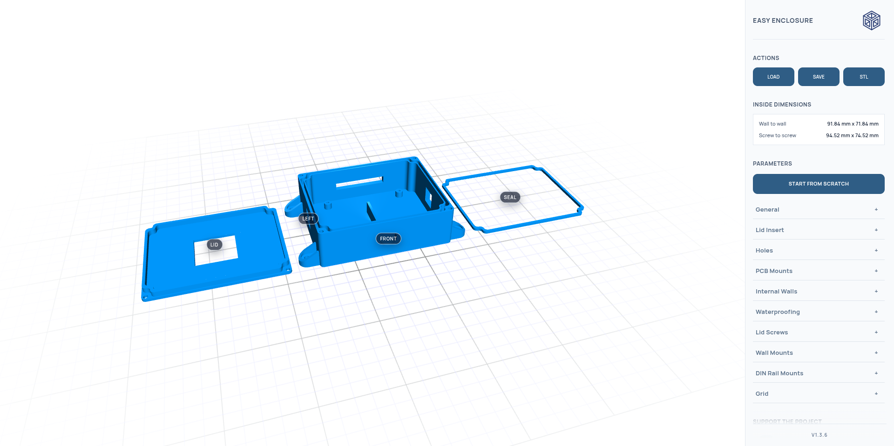

# Easy Enclosure



EasyEnclosure is an open-source 3D modeling software tailored specifically for designing 3D-printable enclosures. It aims to provide an intuitive interface and a set of user-friendly controls that allow even those with little or no 3D modeling experience to create custom enclosures for their electronic projects, prototypes, or DIY gadgets.

### **[Try it online now](https://bruceborrett.github.io/easy-enclosure/)**

## Key Features

- User-Friendly Interface
- Real-Time 3D Preview
- Export to STL Format
- Save and load parameter presets as JSON

## Technology Stack

TypeScript, Angular, JSCAD

## Development

### Prerequisites

- Node.js 20+
- npm 10+

### Install

```bash
npm install
```

### Run Locally

```bash
npm run dev
```

This starts the Angular app from the repository root and synchronizes the UI version badge from `package.json`.

### Build

```bash
npm run build
```

### Test

```bash
npm test
```

or watch mode:

```bash
npm run test:watch
```

### Deploy to GitHub Pages

```bash
npm run deploy
```

Deployment publishes `dist/angular-app/browser`.

## Contributions

<a href="https://github.com/sponsors/bruceborrett" target="_blank"></a>
<a href="https://www.buymeacoffee.com/bruceborrett" target="_blank"></a>

If you find this software useful and would like to see further development please consider [donating](https://www.buymeacoffee.com/bruceborrett) or [sponsoring](https://github.com/sponsors/bruceborrett).

It is very time consuming and expensive to continuously test prints with all the various combinations of settings, so you can also help by printing with as many different settings as possible and reporting any issues you may find.

Pull requests are also welcome!

## Fastening & Screw Strategies

When securing the lid to the base, EasyEnclosure provides several hole strategies to match your fastening hardware:

### 1. Blind Holes (Self-Tapping Screws)

- **Best for**: Compact builds, prototypes, and projects where the enclosure will rarely be opened.
- **Pros**:
  - Uses the **least space**: smallest corner bosses, leaving maximum internal volume for PCBs and components.
  - Uses the least filament and prints fastest.
  - Keeps the bottom of the enclosure completely sealed, clean, and waterproof.
  - No special tools or extra hardware required (screws directly into the 3D-printed plastic).
- **Cons**:
  - Repeated assembly and disassembly will wear out the plastic threads over time.

### 2. Blind Holes (Heat-Set Threaded Inserts)

- **Best for**: Professional enclosures requiring frequent opening and long-term durability.
- **Pros**:
  - Provides strong, wear-resistant brass machine threads that can be assembled and disassembled indefinitely.
  - Bosses are compact (smaller than hex nut pockets, though slightly larger than self-tapping pilot holes).
  - Keeps the bottom of the enclosure solid, closed, and waterproof.
- **Cons**:
  - Requires brass heat-set inserts (e.g., M3) and a soldering iron to install them.

### 3. Captive Hex Nut Pockets

- **Best for**: Strong machine screw fastening using standard, widely available hardware without needing a soldering iron.
- **Pros**:
  - Strong metal-on-metal clamping using ordinary hex nuts and machine bolts.
  - No special insertion tools needed.
- **Cons**:
  - Hex nuts require significantly larger corner bosses to provide adequate wall thickness, reducing internal space, using more filament, and increasing print times.
  - Requires screws with a length matching the exact combined height of the base and lid.
  - Leaves openings on the underside of the base.

### 4. Through Holes

- **Best for**: Long through-bolts with external nuts on the bottom, mounting standoffs, or clamping the entire enclosure to a surface.

## Notes

- All measurements are in millimeters
- Enclosures intended for outdoor use should be printed with PETG filament
- Waterproof seal should be printed with TPU filament
- Supports are required for holes
- Overall height = Base Height + wall thickness
- Inner height = Base Height - wall thickness
- Inner width = width - (wall thickness \* 2)
- Inner length = length - (wall thickness \* 2)
- Screws take up extra space in corners, keep this in mind when deciding length and width
- PCB mount X and Y is derived from center of base
