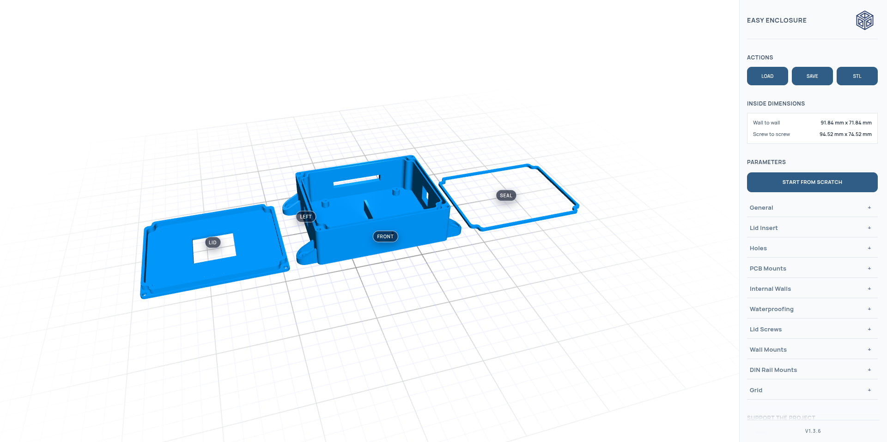

# Easy Enclosure



EasyEnclosure is an open-source 3D modeling software tailored specifically for designing 3D-printable enclosures. It aims to provide an intuitive interface and a set of user-friendly controls that allow even those with little or no 3D modeling experience to create custom enclosures for their electronic projects, prototypes, or DIY gadgets.

### **[Try it online now](https://bruceborrett.github.io/easy-enclosure/)**

## Key Features

- User-Friendly Interface
- Real-Time 3D Preview
- Export to STL (Mesh) and STEP (Solid CAD) Formats
- Parametric Snap-Fit Clippable Lids (screwless assembly)
- High-strength PCB standoffs with parametric root fillets/chamfers
- Save and load parameter presets as JSON

## Export Formats

EasyEnclosure supports multiple 3D exchange formats with single-file download and multi-part ZIP bundling:

- **STL (Mesh)**: Triangulated surface mesh for 3D printing slicers (Cura, PrusaSlicer, Bambu Studio, OrcaSlicer).
- **STEP (Solid CAD)**: Standard ISO-10303-21 (AP214) faceted boundary representation for CAD modeling and assembly interoperability (FreeCAD, Autodesk Fusion 360, SolidWorks, Onshape).

Exports can include the complete enclosure assembly or selected components (base, lid, waterproof TPU seal, PCB mounting standoffs, and DIN rail clips). An extensible export registry (`ExportFormatService`) enables adding additional formats (such as 3MF or OBJ) in the future.

## Technology Stack

TypeScript, Angular, JSCAD

## Development

### Prerequisites

- Node.js 20+
- npm 10+

### Install

```bash
npm install
```

### Run Locally

```bash
npm run dev
```

This starts the Angular app from the repository root and synchronizes the UI version badge from `package.json`.

### Build

```bash
npm run build
```

### Test

```bash
npm test
```

or watch mode:

```bash
npm run test:watch
```

### Deploy to GitHub Pages

```bash
npm run deploy
```

Deployment publishes `dist/angular-app/browser`.

## Contributions

<a href="https://github.com/sponsors/bruceborrett" target="_blank"></a>
<a href="https://www.buymeacoffee.com/bruceborrett" target="_blank"></a>

If you find this software useful and would like to see further development please consider [donating](https://www.buymeacoffee.com/bruceborrett) or [sponsoring](https://github.com/sponsors/bruceborrett).

It is very time consuming and expensive to continuously test prints with all the various combinations of settings, so you can also help by printing with as many different settings as possible and reporting any issues you may find.

Pull requests are also welcome!

## Fastening & Screw Strategies

When securing the lid to the base, EasyEnclosure provides several hole strategies to match your fastening hardware:

### 1. Blind Holes (Self-Tapping Screws)

- **Best for**: Compact builds, prototypes, and projects where the enclosure will rarely be opened.
- **Pros**:
  - Uses the **least space**: smallest corner bosses, leaving maximum internal volume for PCBs and components.
  - Uses the least filament and prints fastest.
  - Keeps the bottom of the enclosure completely sealed, clean, and waterproof.
  - No special tools or extra hardware required (screws directly into the 3D-printed plastic).
- **Cons**:
  - Repeated assembly and disassembly will wear out the plastic threads over time.

### 2. Blind Holes (Heat-Set Threaded Inserts)

- **Best for**: Professional enclosures requiring frequent opening and long-term durability.
- **Pros**:
  - Provides strong, wear-resistant brass machine threads that can be assembled and disassembled indefinitely.
  - Bosses are compact (smaller than hex nut pockets, though slightly larger than self-tapping pilot holes).
  - Keeps the bottom of the enclosure solid, closed, and waterproof.
- **Cons**:
  - Requires brass heat-set inserts (e.g., M3) and a soldering iron to install them.

### 3. Captive Hex Nut Pockets

- **Best for**: Strong machine screw fastening using standard, widely available hardware without needing a soldering iron.
- **Pros**:
  - Strong metal-on-metal clamping using ordinary hex nuts and machine bolts.
  - No special insertion tools needed.
- **Cons**:
  - Hex nuts require significantly larger corner bosses to provide adequate wall thickness, reducing internal space, using more filament, and increasing print times.
  - Requires screws with a length matching the exact combined height of the base and lid.
  - Leaves openings on the underside of the base.

### 4. Through Holes

- **Best for**: Long through-bolts with external nuts on the bottom, mounting standoffs, or clamping the entire enclosure to a surface.

### 5. Snap-Fit (Screwless Clippable Lids)

- **Best for**: Tool-free assembly, quick access battery compartments, sensor housings, and compact enclosures without screws.
- **Mechanism**: Parametric horizontal retention beads extruded along the lid insert rim snap into mating detent pockets cut into the interior base walls. Bead profiles use smooth elliptical arcs for easy insertion and positive retention without layer delamination.
- **Snap Configurations**:
  - **4 Clips** (Default): 2 clips on each of the two longer sides.
  - **6 Clips**: 2 clips on each longer side + 1 centered clip on each shorter side.
  - **8 Clips**: 2 clips distributed on all four sides.
- **Tunable Parameters**: Bead width along the edge, protrusion depth, bead height, mating pocket clearance, and corner setback percentage.
- **Safety Safeguard**: Snap bead projection depth is automatically clamped to $80\%$ of enclosure wall thickness to ensure outer wall integrity. Can be combined with or used instead of corner lid screws.

### Screw Head Recesses & Lid Thickness

When enabling screw head recesses (**Counterbore** or **Countersunk**), the recess is cut directly into the top of the lid. Ensure that your **Lid Thickness (`roof`)** in the Dimensions tab is greater than the recess depth so a solid clamping shoulder remains:

- **Countersunk Screws (DIN 7991 / ISO 10642)**:
  - M3 countersunk heads are $\approx 1.7\text{ mm}$ deep ($90^\circ$ cone).
  - Recommended Lid Thickness (`roof`): **$2.5 - 3.0\text{ mm}$**, which leaves $0.8 - 1.3\text{ mm}$ of solid plastic to bear screw clamping force.
- **Counterbore (Socket Head Cap Screws - DIN 912)**:
  - Standard M3 socket cap screw heads are $\approx 3.0\text{ mm}$ tall and $\approx 5.5\text{ mm}$ in diameter.
  - Recommended Lid Thickness (`roof`): **$4.0 - 4.5\text{ mm}$** with a $3.0\text{ mm}$ recess depth.
- **Counterbore (Low-Profile Button Head Screws - ISO 7380)**:
  - Button head screws have a head height of only $\approx 1.65\text{ mm}$.
  - Recommended Lid Thickness (`roof`): **$2.5 - 3.0\text{ mm}$** with a $1.7\text{ mm}$ recess depth.

> **Tip**: Increasing the lid roof thickness by $1 - 1.5\text{ mm}$ uses very little filament (just a thin flat layer), while keeping the four vertical base corner posts compact to maximize usable internal space for your PCB.

### PCB Mount Standoff Reinforcement

Standard cylindrical standoffs printed vertically along the Z-axis in FDM 3D prints are vulnerable to shearing off at the first layer where they meet the enclosure floor or lid due to stress concentration under screw insertion torque. EasyEnclosure provides parametric root reinforcement:

- **Fillet (Concave Arc)** _(Default)_: A smooth circular transition ($360^\circ$ annular radius) that eliminates the sharp internal corner notch, providing maximum isotropic strength against both lateral shear and screw tightening torque while staying within standard circular PCB keep-out rings.
- **Chamfer (45° Flare)**: A straight conical transition widening the base footprint.
- **None**: Traditional straight cylindrical standoff.

Root reinforcement can be configured globally in the PCB Mounts tab or overridden per standoff for tight component clearance constraints.

## Notes

- All measurements are in millimeters
- Enclosures intended for outdoor use should be printed with PETG filament
- Waterproof seal should be printed with TPU filament
- Supports are required for holes
- Overall height = Base Height + wall thickness
- Inner height = Base Height - wall thickness
- Inner width = width - (wall thickness \* 2)
- Inner length = length - (wall thickness \* 2)
- Screws take up extra space in corners, keep this in mind when deciding length and width
- PCB mount X and Y is derived from center of base
